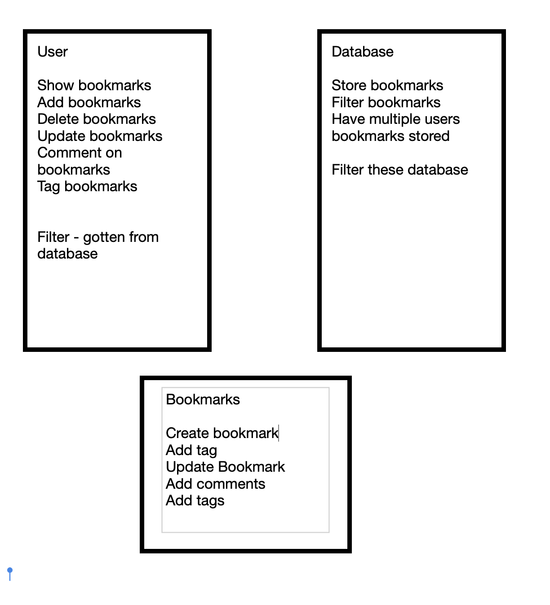

USER STORIES

As a user of the website
So I know what bookmarks I have made
I would like the website to show a list of bookmarks

As a user of the website
So I can improve my saved bookmarks
I would like to be able to add new bookmarks

As a user of the website
So I can keep my bookmarks up to date
I would like to be able to delete bookmarks

As a user of the website
So I can keep my bookmarks up to date
I would like to be able to update old bookmarks

As a user of the website
So I can organise my bookmarks
I would like to be able to tag bookmarks

As a user of the website
So I can find relevant bookmarks
I would like to be able to filter bookmarks by tag

As a user of the website
So only I can edit my bookmarks
I would like to be restricted to only being able to manage my bookmarks

To set up the database:
Connect to psql
Create the database using the psql command CREATE DATABASE bookmark_manager;
Connect to the database using the pqsl command \c bookmark_manager;
Run the query we have saved in the file 01_create_bookmarks_table.sql